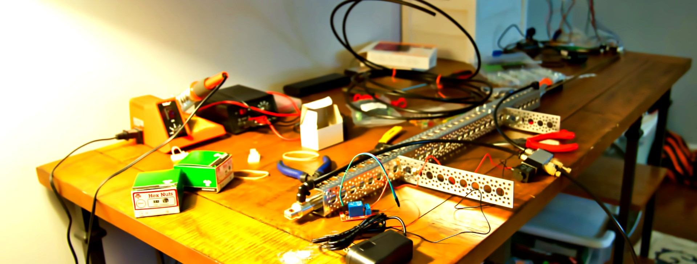

---
IoTやエッジAIの可能性が広がるに連れハードウェアエンジニアリングの重要性はますます高まっています。しかしハードウェアは魑魅魍魎とした世界で何から勉強した良いのかわかりません。そこで本ブログではソフトウェアや機械学習を少しかじってきた私たちが、ハードウェアエンジニアリングに入門する過程を日記形式で記録していこうと思います。ゆくゆくはハードウェアの世界に飛び込むためのロードマップを作りたい。

